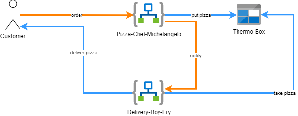

## Lab 1 - Logic Apps



### Deploying the resources

```bash
az group create \
  --name 'pizza-lab-1'\
  --location westeurope \
  --tags workshop=azureIntegration

az deployment group create \
  --resource-group 'pizza-lab-1' \
  --template-file ./azuredeploy.bicep \
  --parameters pizzaChefName='michelangelo' \
      deliveryBoyName='fry'
```

> **Note**: After the deployment succeeded, you need to manually authorize the o365 connection via the Azure portal (Edit API connection/Authorize/Save). You need to use an o365 account. Personal accounts without o365 license won't work.

### Calling the pizza chef from Postman

Create a POST request in [Postman](https://www.postman.com/downloads/) and add the following json body:

```json
{
  "customer_name": "{{$randomFirstName}}",
  "customer_address": "some.customer@outlook.com",
  "pizza_type": "Hawaii"
}
```