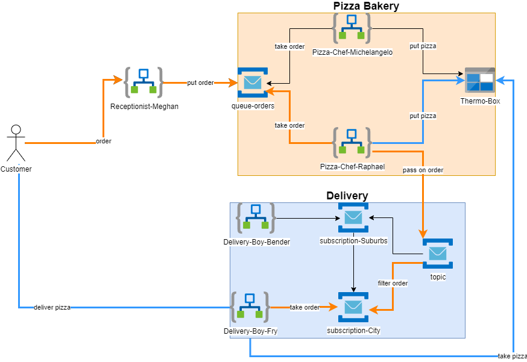

## Lab 3 - Service Bus Topics



### Deployment

Deploy the lab:

```bash
rg=rg-pizza-lab3
az group create -n $rg -l westeurope
az deployment group create -f lab-3/azuredeploy.bicep -g $rg
```

Deploy additional pizza chefs:

```bash
rg=rg-pizza-lab3
az deployment group create -f lab-3/pizza-chef.bicep -g $rg --parameters pizzaChefName=michelangelo
```

Deploy additional delivery boys for delivery zone "city" (default):

```bash
rg=rg-pizza-lab3
az deployment group create -f lab-3/delivery-boy.bicep -g $rg --parameters deliveryBoyName=fry
```

### Calling the pizza chef from Postman

Create a POST request in Postman and add the following json body:

```json
{
  "customer_name": "{{$randomFirstName}}",
  "customer_address": "some.customer@outlook.com",
  "pizza_type": "Hawaii",
  "delivery_zone": "city"
}
```