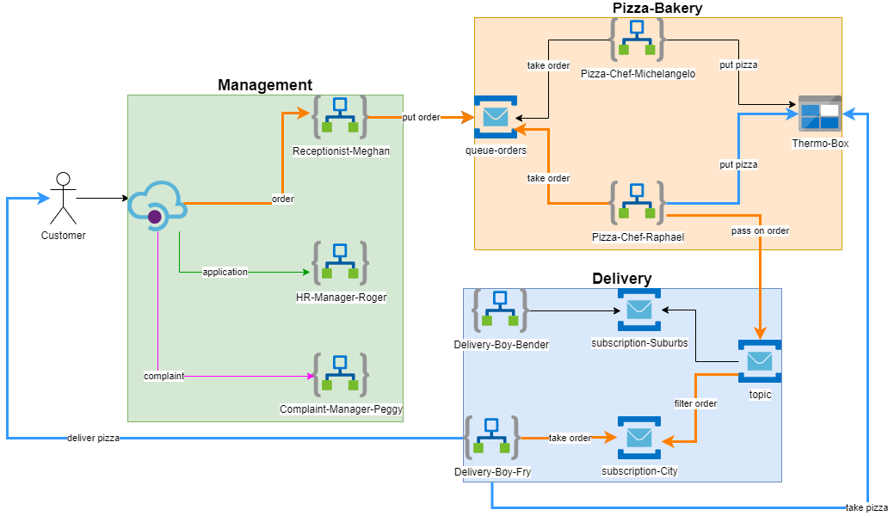

## Lab 4 - API Management



### Deploying the resources

```bash
az group create \
  --name 'pizza-lab-4'\
  --location westeurope \
  --tags workshop=azureIntegration 

az deployment group create \
  --resource-group 'pizza-lab-4' \
  --template-file ./azuredeploy.bicep \
  --parameters pizzaChefName='michelangelo' \
      deliveryBoyName='fry' \
      receptionistName='meghan' \
      deliveryZoneName='city' \
      apiManagementSkuPublisherEmail='email@customer.lt'
```

**Note**: After the deployment succeeded, you need to manually authorize the o365 connection via the Azure portal (Edit API connection/Authorize/Save). You need to use an o365 account. Personal accounts without o365 license won't work.

### Calling the receptionist from Postman

Create a POST request in [Postman](https://www.postman.com/downloads/) and add the following json body:

```json
{
  "customer_name": "{{$randomFirstName}}",
  "customer_address": "some.customer@outlook.com",
  "pizza_type": "Margarita",
  "delivery_zone": "city"
}
```

### Deploying additional pizza chefs

```bash
az deployment group create \
  --resource-group 'pizza-lab-4' \
  --template-file ./pizza-chef.bicep \
  --parameters pizzaChefName='raphael'
```

### Deploying additional delivery zones

```bash
serviceBusName=$(az servicebus namespace list -g pizza-lab-3 -o tsv --query '[0].name')

az deployment group create \
  --template-file ./delivery-zone.bicep \
  --resource-group 'pizza-lab-4' \
  --parameters deliveryZone='suburb' \
    serviceBusName=$serviceBusName
```

### Deploying additional delivery boys

```bash
az deployment group create \
  --resource-group 'pizza-lab-4' \
  --template-file ./delivery-boy.bicep \
  --parameters deliveryZone='suburb' \
      deliveryBoyName='bender'
```

New delivery boys need to be assigned to an existing deliveryZone. Use the following command to see all currenty available delivery zones (topic subscriptions)

```bash
serviceBusName=$(az servicebus namespace list -g pizza-lab-3 -o tsv --query '[0].name')
az servicebus topic subscription list \
  --resource-group 'pizza-lab-3' \
  --namespace-name $serviceBusName \
  --topic-name pizza-delivery --query '[].name'
```

>**Note:** The prefix `delivery-zone-` is automatically added during deployment.